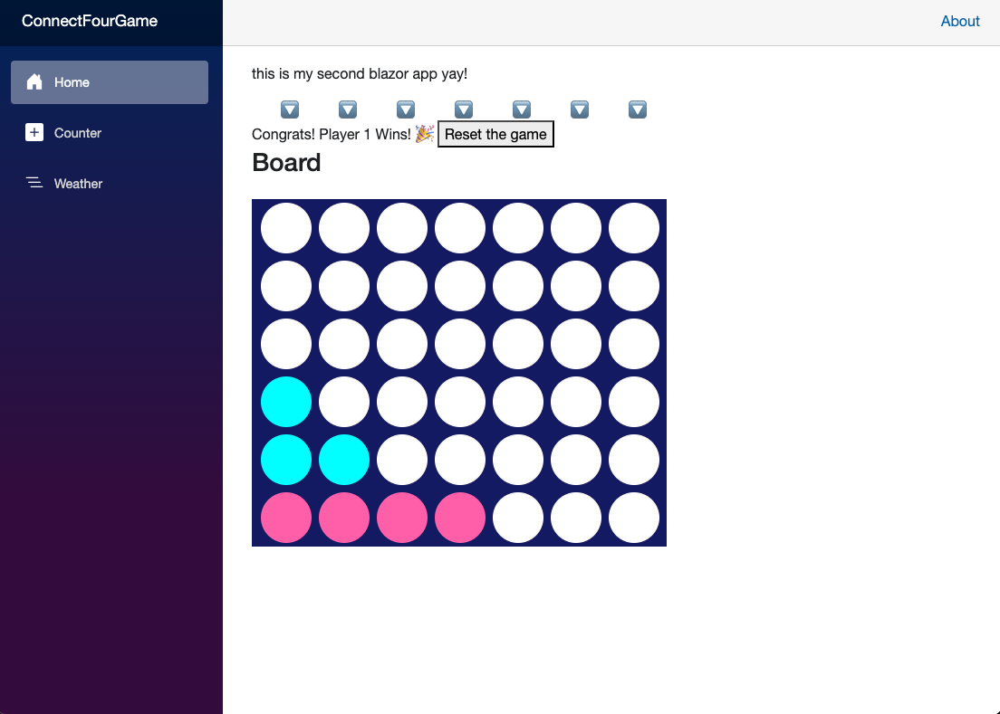

# 🎮 Connect Four Game (Blazor Web App)

A simple two-player Connect Four game built with **Blazor**.  
Runs locally in the browser using .NET.

## 🧩 Features
- Two-player turn-based gameplay  
- Customizable board and player colors  
- Game reset button with basic error handling

## 🧠 Game Rules
- Players take turns dropping pieces into one of the 7 columns.
- First player to connect 4 pieces in a row — horizontally or vertically.
- If the board fills up with no winner, it's a tie.

## 🖼 Preview
